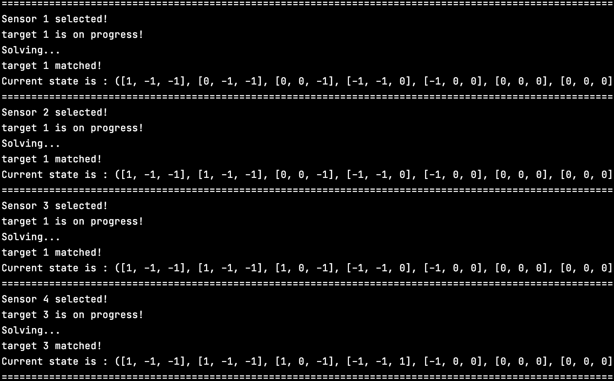
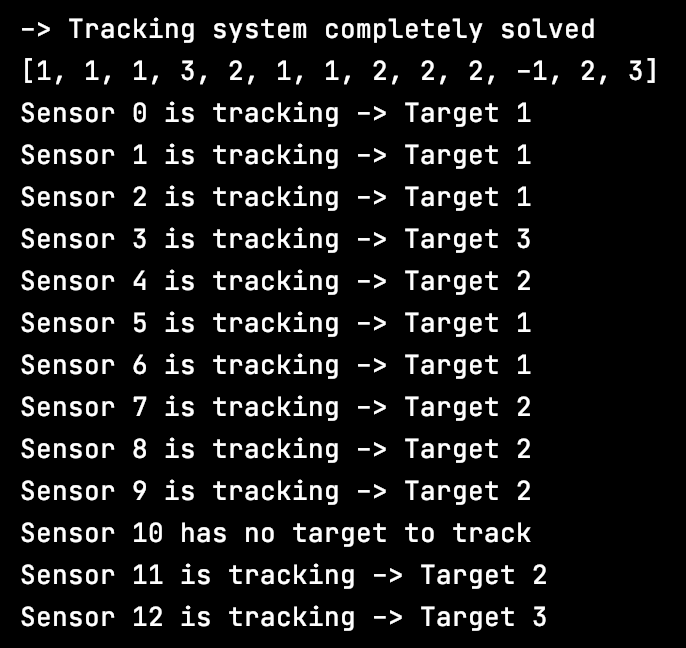
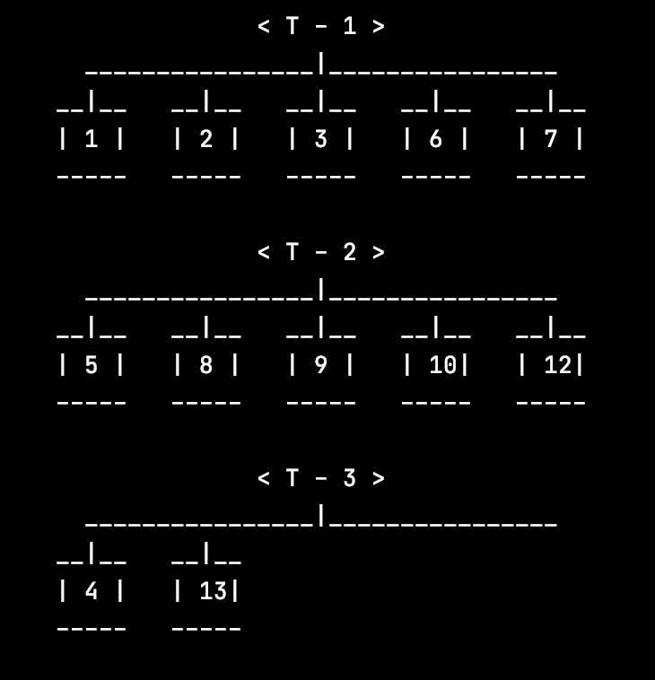

# AI_TrackingSystemWithWirelessSensors
Artificial Intelligence Corse. Aria Radmehr - Sara Veiseh  
Professor M. Afasharchi  
May 5, 2021  
  
  
In this project, the program assigns and tracks objects to wireless sensors with CSP Algorithm.  
Threre are two rules which must be observed:  
1- Each sensor can track only one object.  
2- Sensors which are connected to each other can track one specific object together.  
  
  
Figure 1 (Logs):  
  
  
Figure 2 (Show Results):  
  
  
Figure 3 (TUI Mapper):  
  
